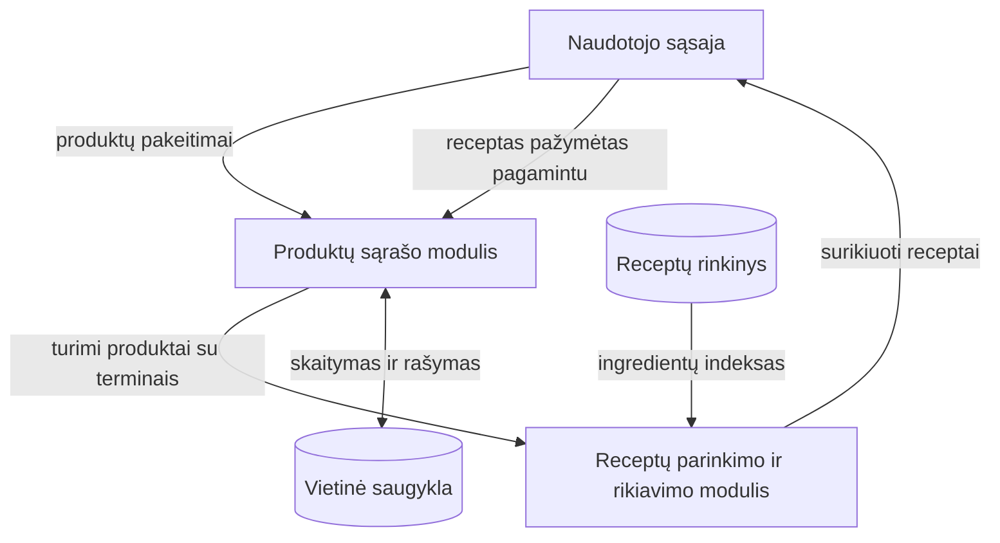

# Still Good

Kursinio darbo I dalis: projektavimo dokumentas

## 1. Problema ir idėja

**Sistema vienu sakiniu:** Mobilioji programa, padedanti greitai apsispręsti, ką pagaminti iš namuose turimų produktų, pirmiausia siūlant tuos, kurių galiojimas baigiasi greičiausiai.

**Problema ir dabartinis procesas:** Namų ūkiuose išmetama daug dar tinkamo vartoti maisto. Pagrindinė priežastis - ne maisto kokybė, o planavimas: perkame daugiau, nei suvalgome, dalis produktų nukeliauja į šaldytuvo gilumą, o apie juos prisimename tik tada, kai jie jau sugedę. Sprendimas, ką gaminti, dažniausiai priimamas skubant, todėl renkamės ne tai, ką reikėtų sunaudoti, o tai, ką pagaminti greičiausia.

Esami sprendimai šios priežasties nesprendžia. Receptų portalai veikia atvirkščiai, nei veikia realus namų ūkis - pirma pasirenkamas receptas, tada perkami trūkstami produktai. Receptų parinkimo pagal turimus produktus įrankiai kryptį pasirenka teisingą, bet nevertina galiojimo terminų, todėl nepadeda sunaudoti to, kas greičiausiai suges. Programos, kuriose galiojimo sekimas yra, šią funkciją paprastai užrakina už mokamos versijos arba susieja su išmaniuoju šaldytuvu.

Antra problema - pasirinkimo gausa. Esami sprendimai pateikia ilgą receptų sąrašą ir sprendimą palieka naudotojui.

**Idėja:** Programa receptus pateikia ne sąrašu, o po vieną - kortelėmis, kurias naudotojas peržiūri perbraukimo judesiu, kaip „Instagram Reels". Toks pateikimo būdas pasirinktas dėl dviejų priežasčių: sprendimas priimamas vienu veiksmu, o pats judesys naudotojams jau įprastas, todėl sąsajos mokytis nereikia. Pilnas sąrašas lieka kaip alternatyvus rodinys tiems, kurie nori rinktis patys.

**Nauda:** Mažiau išmesto maisto ir trumpesnis sprendimo laikas. Vietoje to, kad naudotojas pats prisimintų, kas guli šaldytuvo gilumoje, programa pati pasiūlo, ką sunaudoti pirmiausia.

**Naudotojai:** Suaugę asmenys, gaminantys maistą namuose. Numatomi trys naudotojų tipai: gaminantis nereguliariai ir nežinantis tikslaus šaldytuvo turinio; gaminantis kasdien šeimai, kuriam apsispręsti sunku ne dėl produktų trūkumo, o dėl jų gausos; gyvenantis vienas ir gaminantis paprastai, kuriam svarbiausias greitis. Veiksmai: įtraukti ir šalinti produktus, peržiūrėti receptų korteles, pasirinkti receptą ir pažymėti jį pagamintu.

**Prielaidos:**

- Darome prielaidą, kad naudotojas sutiks suvesti produktus tik tuo atveju, jei dažniausiai naudojamiems užteks vieno paspaudimo. Rankinis kiekvieno produkto vedimas laikomas pagrindiniu atgrasančiu veiksniu.
- Darome prielaidą, kad galiojimo terminas dažniausiai nebus nurodomas, todėl numatytieji terminai pagal produkto tipą turi būti pakankamai tikslūs, kad rikiavimas išliktų prasmingas.
- Darome prielaidą, kad pavyks sudaryti receptų rinkinį su struktūrizuotais ingredientų sąrašais.

## 2. Apimtis

| Funkcija | Ką naudotojas galės atlikti | Pagrindinis modulis ar pagalbinė funkcija |
|---|---|---|
| Receptų parinkimas ir rikiavimas | Gauti receptus iš turimų produktų, surikiuotus pagal tai, kurie sunaudoja greičiausiai gendančius produktus | **Pagrindinis modulis** |
| Produktų sąrašo tvarkymas | Įtraukti produktą vienu paspaudimu arba ranka, nurodyti galiojimo datą arba palikti ją nenurodytą, pašalinti produktą | Pagalbinė |
| Pirkinių čekio fotografavimas | Nufotografuoti čekį ir įtraukti nupirktus produktus, prieš tai patvirtinus atpažintą sąrašą. Antrinis suvedimo būdas, kurio įgyvendinimas dar nėra tikras (žr. 7 skyrių) | Pagalbinė |
| Receptų pateikimas kortelėmis | Peržiūrėti receptus po vieną perbraukimo judesiu ir pasirinkti vienu veiksmu | Pagalbinė |
| Produktų nurašymas | Pažymėti receptą pagamintu, kad panaudoti produktai dingtų iš sąrašo | Pagalbinė |

**Į kursinio darbo apimtį neįeina:** naudotojų paskyros ir duomenų sinchronizavimas tarp įrenginių; serverio dalis (visi duomenys saugomi įrenginyje); maistingumo skaičiavimas ir dietos planavimas; naudotojų kuriami receptai.

## 3. Pagrindinis modulis

**Pavadinimas ir atsakomybė:** Receptų parinkimo ir rikiavimo modulis. Iš viso receptų rinkinio atrenka tuos, kuriuos galima pagaminti iš turimų produktų, ir surikiuoja pagal skubumą.

**Logika, kurią reikės projektuoti ir testuoti:** Aibių palyginimas (recepto ingredientai prieš turimus produktus), skubumo balo skaičiavimas pagal likusias galiojimo dienas ir konfliktų sprendimas, kai keli receptai gauna vienodą balą.

**Įvestis:** Turimų produktų sąrašas (su kiekiais, jei jie nurodyti), receptų rinkinys su ingredientų kiekiais ir šiandienos data. Data perduodama kaip parametras, kad testų rezultatai nepriklausytų nuo paleidimo dienos.
Pavyzdys: `[kiaušiniai (galioja po 1 d.), sūris (po 3 d.), pienas (po 5 d.), miltai (po 180 d.)]` ir 500 receptų.

**Išvestis:** Surikiuotas receptų sąrašas su skubumo balu ir trūkstamais produktais.
Pavyzdys: `1. Omletas su sūriu (balas 5, trūksta 0), 2. Blynai (balas 4, trūksta 0), 3. Sūrio pyragas (balas 5, trūksta 1: grietinė)`.

**Veikimo eiga:** Produktams be datos priskiriamas numatytasis terminas → apskaičiuojamos likusios dienos → pasibaigę produktai pažymimi ir neįskaičiuojami → pagal ingredientų indeksą atrenkami receptai, turintys bent vieną galiojantį produktą → nustatoma, kiek produktų trūksta arba kurių nepakanka kiekio → atmetami receptai, kuriems trūksta daugiau nei dviejų → apskaičiuojamas skubumo balas → receptai surikiuojami.

### Taisyklės

1. Receptas laikomas pagaminamu, jei visi jo privalomi ingredientai yra produktų sąraše, nėra pasibaigę (6 taisyklė) ir jų pakanka (7 taisyklė). Neprivalomi ingredientai (prieskoniai, papuošimui) į palyginimą neįtraukiami.
2. Receptas, kuriam trūksta vieno ar dviejų privalomų ingredientų, rodomas atskiroje grupėje po pagaminamų receptų, nurodant, ko trūksta. Jei ingredientas sąraše yra, bet pasibaigęs arba jo nepakanka, tai nurodoma prie jo: „pasibaigęs galiojimas" arba „nepakanka kiekio: dar X". Trūkstant trijų ar daugiau arba neturint nė vieno galiojančio ingrediento - nerodomas.
3. Likusios dienos lygios galiojimo datai minus šiandienos data. Produkto skubumo balas pagal likusias dienas: 0-1 diena - 3 balai, 2-3 dienos - 2 balai, 4-7 dienos - 1 balas, daugiau nei 7 dienos - 0 balų. Recepto balas lygus jo sunaudojamų galiojančių produktų balų sumai. Produktas, kurio kiekio nepakanka, į balą įskaičiuojamas, nes receptas sunaudotų visą turimą kiekį.
4. Jei galiojimo data nenurodyta, taikomas numatytasis terminas pagal produkto tipą (pienas - 5 dienos, mėsa - 3 dienos, konservai - 365 dienos), skaičiuojamas nuo įtraukimo dienos.
5. Esant vienodam balui, pirmiau rodomas receptas, sunaudojantis daugiau turimų produktų. Jei ir tada vienodai - pagal trumpesnę gaminimo trukmę.
6. Produktas, kurio likusių dienų skaičius neigiamas, laikomas pasibaigusiu: parinkime jis laikomas nesančiu sąraše ir balų neduoda. Produktas, galiojantis iki šiandienos (0 dienų), dar laikomas galiojančiu. Taisyklė taikoma ir numatytajai datai. Pasibaigę produktai sąraše pažymimi, bet automatiškai nešalinami, nes sistema negali žinoti, ar produktas tikrai sugedo.
7. Kiekvienas produktas turi vieną matavimo vienetą (vnt., g arba ml), kurį naudoja ir receptai. Jei kiekis nurodytas, jo pakanka, kai visų galiojančių to paties produkto įrašų kiekių suma yra ne mažesnė už recepte nurodytą kiekį. Tokiu atveju balas skaičiuojamas pagal anksčiausiai baigiantį galioti įrašą. Jei bent vieno galiojančio įrašo kiekis nenurodytas, laikoma, kad produkto pakanka.

### Scenarijai būsimiems testams

| Scenarijus | Pradinės sąlygos ir konkreti įvestis | Veiksmas | Tikslus laukiamas rezultatas |
|---|---|---|---|
| Įprastas atvejis | 12 produktų: kiaušiniai galioja 1 d. (3 balai), sūris 3 d. (2 balai), likę ilgiau nei 7 d. (0 balų). Receptai: omletas su sūriu (kiaušiniai + sūris), blynai (kiaušiniai + pienas + miltai) | Atveriamas receptų ekranas | Pirma kortelė - omletas su sūriu (balas 5), antra - blynai (balas 3). Abu grupėje „galima pagaminti" |
| Ribinis atvejis | Du receptai turi vienodą balą 3. Pirmasis sunaudoja 3 turimus produktus, antrasis - 5 | Atveriamas receptų ekranas | Pirmas rodomas receptas, sunaudojantis 5 produktus (5 taisyklė) |
| Klaida arba neįmanomas rezultatas | Sąraše 3 produktai. Nėra recepto, kuriam trūktų 2 ar mažiau produktų | Atveriamas receptų ekranas | Kortelės nerodomos. Pateikiamas pranešimas, kad iš turimų produktų receptų nerasta, ir pasiūloma įtraukti daugiau produktų. Tuščias ekranas be paaiškinimo nerodomas |
| Pasibaigęs galiojimas | Kiaušiniai 6 vnt. iki 2026-10-05 (-1 d.), sūris 200 g iki 2026-10-08 (2 d.), pienas 1000 ml iki 2026-10-20, miltai 1000 g iki 2027-03-01. Receptai: omletas su sūriu (kiaušiniai 3 vnt., sūris 100 g), sūrio padažas (sūris 100 g, pienas 300 ml, miltai 30 g) | Atveriamas receptų ekranas | 1. Sūrio padažas (balas 2, „galima pagaminti"). 2. Omletas su sūriu (balas 2, trūksta 1: kiaušiniai (pasibaigęs galiojimas)). Pagal ankstesnę taisyklę omletas būtų pirmas su balu 5 |
| Ribinis atvejis: galioja šiandien | Kiaušiniai 4 vnt. iki 2026-10-06 (0 d.), sūris 200 g iki 2026-10-05 (-1 d.). Receptai: kiaušinienė (kiaušiniai 2 vnt.), omletas su sūriu (kiaušiniai 3 vnt., sūris 100 g) | Atveriamas receptų ekranas | 1. Kiaušinienė (balas 3, „galima pagaminti"). 2. Omletas su sūriu (balas 3, trūksta 1: sūris (pasibaigęs galiojimas)) |
| Nepakankamas kiekis | Kiaušiniai 2 vnt. iki 2026-10-07 (1 d.), sūris 200 g iki 2026-10-09 (3 d.). Receptai: omletas su sūriu (kiaušiniai 3 vnt., sūris 100 g), kiaušinienė (kiaušiniai 2 vnt.) | Atveriamas receptų ekranas | 1. Kiaušinienė (balas 3, „galima pagaminti"). 2. Omletas su sūriu (balas 5, trūksta 1: kiaušiniai (nepakanka kiekio: dar 1 vnt.)). Omletas antras, nors jo balas didesnis |
| Keli įrašai, vienas pasibaigęs | Kiaušiniai: 2 vnt. iki 2026-10-05 (-1 d.), 1 vnt. iki 2026-10-07 (1 d.), 1 vnt. iki 2026-10-15 (9 d.). Pienas 1000 ml iki 2026-10-20, miltai 1000 g iki 2027-03-01. Receptas: blynai (kiaušiniai 3 vnt., pienas 500 ml, miltai 200 g) | Atveriamas receptų ekranas | Blynai (balas 3, trūksta 1: kiaušiniai (nepakanka kiekio: dar 1 vnt.)). Galiojantys įrašai sudeda 2 vnt., pasibaigęs neįskaičiuojamas |

**Jei modulis naudoja AI:** Pats pagrindinis modulis AI nenaudoja. Jis veikia pagal aiškiai apibrėžtas taisykles, todėl kiekvieną receptui priskirtą balą galima paaiškinti nurodant, kurios taisyklės buvo pritaikytos. Tai sąmoningas sprendimas - AI pagrįsto rikiavimo rezultato taip paaiškinti nebūtų galima.

AI numatytas tik viename pagalbiniame komponente - čekio teksto atpažinime. Sistemos atsakomybė: atpažintos eilutės lyginamos su uždaru produktų sąrašu, neatitinkančios atmetamos, o rezultatas niekada nepatenka į produktų sąrašą automatiškai - naudotojui rodomas patvirtinimo ekranas, kuriame jis pašalina klaidingai atpažintus ir prideda praleistus produktus. Neatpažinus nei vieno produkto, siūloma suvesti rankiniu būdu. Kokybę vertinsiu su 20 realių čekių, kriterijus - ne mažiau kaip 70 procentų teisingai atpažintų produktų.

Šis komponentas yra atskirtas nuo pagrindinio modulio ir nuo jo nepriklauso, todėl nepavykus pasiekti atpažinimo kokybės kriterijaus funkcijos bus atsisakyta, o programa liks veikianti - produktai bus suvedami vienu paspaudimu arba ranka. Tai yra vienas iš didžiausių darbo neaiškumų (žr. 7 skyrių).

## 4. Kokybės atributas

**Pasirinktas atributas:** Naudojamumas (veiksmų skaičius suvedant produktus).

**Kodėl svarbus šiai sistemai:** Programa veikia tik tada, kai produktų sąrašas atitinka tikrovę, o sąrašą pildo pats naudotojas. Jei kiekvienas produktas reikalaus kelių ekranų ir privalomų laukų, sąrašas liks nepildomas ir receptų parinkimas nustos veikti. Tai pagrindinė priežastis, dėl kurios panašiomis programomis nustojama naudotis.

**Tikrinimo scenarijus ir sąlygos:** Naudotojas atsidaro programą ir įtraukia 10 dažniausiai perkamų produktų (pienas, kiaušiniai, duona ir pan.), nenurodydamas galiojimo datų. Skaičiuojami paspaudimai nuo programos atidarymo iki paskutinio produkto įtraukimo.

**Sėkmės kriterijus:** Vienam dažniausiai naudojamam produktui įtraukti pakanka ne daugiau kaip 2 paspaudimų, o visiems 10 produktų - ne daugiau kaip 20 paspaudimų.

**Numatytas projektavimo sprendimas:** Pagrindiniame ekrane rodoma dažniausiai naudojamų produktų lentelė, kurioje produktas įtraukiamas vienu paspaudimu. Atskiro pridėjimo ekrano nėra. Kiekis ir galiojimo data yra neprivalomi laukai, todėl jų nenurodžius joks papildomas veiksmas nereikalingas.

**Kaip patikrinsiu vėlesniame etape:** Atliksiu scenarijų pats ir suskaičiuosiu paspaudimus. Jei kuriam nors produktui prireiks daugiau nei 2 paspaudimų, užrašysiu, kuris veiksmas buvo perteklinis.

**Sprendimo kaina arba ribojimas:** Dažniausiai naudojamų produktų lentelė užima vietą pagrindiniame ekrane, todėl pačiam produktų sąrašui jos lieka mažiau. Taip pat reikia iš anksto nuspręsti, kurie produktai yra dažniausi, o tai bus spėjimas, kol nebus realių naudojimo duomenų.

## 5. Pradinė sistemos struktūra

| Sistemos dalis | Atsakomybė |
|---|---|
| Naudotojo sąsaja | Produktų įtraukimas ir šalinimas, receptų kortelių rodymas po vieną, recepto pažymėjimas pagamintu |
| Produktų sąrašo modulis | Sąrašo tvarkymas, numatytųjų terminų priskyrimas, likusių dienų skaičiavimas, produktų nurašymas |
| Receptų parinkimo ir rikiavimo modulis | Receptų atranka, trūkstamų produktų nustatymas, skubumo balo skaičiavimas, rikiavimas |
| Receptų rinkinys | Receptų ir ingredientų saugojimas, ingredientų indekso sudarymas |
| Vietinė saugykla | Produktų sąrašo ir pagamintų receptų istorijos išsaugojimas tarp paleidimų |

**Planuojamos technologijos ir pasirinkimo priežastys:**

- **React Native su JavaScript** - pagrindinė kūrimo platforma. Pasirinkau dėl to, kad jau turiu React patirties iš ankstesnių projektų, todėl laiką galėsiu skirti pagrindiniam moduliui, o ne kalbos mokymuisi. Tas pats kodas veikia abiejose mobiliųjų įrenginių operacinėse sistemose.
- **Expo** - kūrimo ir paleidimo aplinka. Ji perima programos surinkimo ir paleidimo emuliatoriuje darbus, todėl nereikia atskirai derinti kūrimo įrankių.
- **React Navigation** - perėjimui tarp produktų ir receptų ekranų.
- **react-native-deck-swiper** - receptų kortelių perbraukimo judesiui. Naudoju paruoštą biblioteką, nes pats judesys nėra šio darbo objektas.
- **Jest** - automatiniams pagrindinio modulio testams. Reikalingas 3 skyriuje aprašytiems scenarijams patikrinti.
- **AsyncStorage** - duomenų saugojimui įrenginyje. Serverio nereikia, o duomenų kiekis nedidelis.

Pagrindinis modulis bus parašytas kaip atskiras JavaScript modulis, nepriklausomas nuo sąsajos ir nuo išvardintų bibliotekų, kad jį būtų galima testuoti atskirai.

## 6. AI panaudojimas

### AI rengiant šį dokumentą

AI naudojau.

| Priemonė ir užduotis | Ką panaudojau | Ką atmečiau arba perrašiau ir kodėl | Kaip patikrinau |
|---|---|---|---|
| Claude, idėjos detalizavimas | Pačią idėją - programą, parenkančią receptus pagal turimus produktus - sugalvojau pats. Claude naudojau jos detalizavimui: kaip suskaidyti funkcijas, kurios iš jų sudaro pagrindinį modulį ir kokios taisyklės turi sudaryti rikiavimo logiką | Atmečiau pasiūlymą receptų rikiavimą patikėti AI modeliui. Taisyklėmis grįstą sprendimą galiu paaiškinti ir patikrinti testais, o AI atsakymo - ne | Palyginau su užduoties reikalavimu, kad pagrindinis modulis turi turėti atskirai analizuojamų ir testuojamų taisyklių |
| Claude, esamų sprendimų apžvalga | Panašių programų sąrašą ir jų funkcijų apžvalgą | Atmečiau teiginį, kad nei viena esama programa nevertina galiojimo terminų. Patikrinęs radau, kad tokių yra, tik funkcija mokama arba susieta su išmaniuoju šaldytuvu, todėl teiginį perrašiau | Funkcijas tikrinau pačiose programose ir jų aprašymuose parduotuvėse |
| Claude, darbo apimties svarstymas | Pagalbą sprendžiant, kurios funkcijos telpa į šio darbo apimtį, o kurių reikia atsisakyti | Iš pradžių čekio fotografavimo atsisakiau visiškai, bet vėliau grąžinau jį kaip neaiškumą, nes funkcijos vertė naudotojui didelė, o rizika aprašyta 7 skyriuje | Kiekvieną funkciją vertinau pagal tai, ar ji prisideda prie pagrindinio modulio ir ar galėčiau ją paaiškinti |
| Claude, dokumento patikrinimas po dėstytojo pastabų | Patikrinimą, ar įgyvendintos visos dėstytojo pastabos ir ar testų scenarijų laukiami rezultatai atitinka taisykles. Claude rado veikimo eigos ir 2 taisyklės neatitikimą bei neaprašytą atvejį 7 taisyklėje (kai dalies įrašų kiekis nenurodytas) | Taisymus apribojau minimaliais, kad dokumentas liktų lengvai skaitomas ir įgyvendinamas | Kiekvieną Claude pastabą peržiūrėjau pats ir taisiau tik tai, ką galėjau paaiškinti |

### Planuojamas AI naudojimas kuriant sistemą

**Kur ir kam naudosiu AI:** Pagalbinio kodo rašymui (sąsajos komponentai, testų ruošiniai) ir klaidų paieškai. Pagrindinio modulio taisykles projektuosiu pats, nes nuo jų priklauso viso darbo vertinimas ir turiu gebėti paaiškinti kiekvieną sprendimą.

**Kaip tikrinsiu pasiūlymus ir sugeneruotą kodą:** Kiekvieną sugeneruotą funkciją paleisiu su 3 skyriuje aprašytais scenarijais ir palyginsiu su laukiamu rezultatu. Kodo, kurio veikimo nesuprantu, nenaudosiu.

**Rizikos:** AI gali pasiūlyti kodą, kuris veikia įprastu atveju, bet neapdoroja ribinių atvejų (tuščias produktų sąrašas, pasibaigęs galiojimas). Dėl to ribinius atvejus testuosiu atskirai.

**Ar AI bus sistemos funkcionalumo dalis:** Numatoma, kad taip, bet tik pagalbinėje funkcijoje - čekio teksto atpažinime. Galutinis sprendimas priklausys nuo atpažinimo kokybės patikrinimo, nes abejoju, ar pavyks pasiekti pakankamą tikslumą su lietuviškais čekiais, kuriuose prekių pavadinimai stipriai trumpinami. Pagrindinis modulis nuo AI nepriklauso ir veikia pagal taisykles, todėl šios funkcijos atsisakius sistema lieka pilnai veikianti.

## 7. Tolesnių darbų planas

| Darbas | Apčiuopiamas rezultatas | Planuojama darbų seka |
|---|---|---|
| Receptų rinkinio ir terminų lentelės paruošimas | 50 receptų su struktūrizuotais ingredientais ir jų kiekiais ir produktų kategorijų lentelė su numatytaisiais terminais | 1 |
| Pagrindinio modulio įgyvendinimas | Veikianti parinkimo ir rikiavimo funkcija su visomis 7 taisyklėmis | 2 |
| Modulio testai | Automatiniai testai pagal 3 skyriuje aprašytus scenarijus, po vieną kiekvienai taisyklei | 3 |
| Produktų sąrašas ir saugykla | Produktų įtraukimas, šalinimas ir išsaugojimas tarp paleidimų | 4 |
| Sąsaja | Produktų ekranas ir receptų kortelių ekranas | 5 |
| Naudojamumo patikrinimas | Suskaičiuoti paspaudimai įtraukiant 10 produktų | 6 |
| Čekio atpažinimo bandymas | Patikrinimo su 20 realių čekių rezultatai ir sprendimas, ar funkcija įgyvendinama | 7 |

**Būsimo prototipo veikimo scenarijus:** Į sąrašą įtrauksiu 10 produktų - dviem nurodysiu artimą galiojimo datą, likusiems datos nenurodysiu, kad būtų matoma numatytųjų terminų taisyklė. Atversiu receptų ekraną ir parodysiu, kad pirma kortelė yra receptas, sunaudojantis greičiausiai baigiančius galioti produktus. Tada įtrauksiu dar vieną produktą ir parodysiu, kad eiliškumas atsinaujina iš karto, be atskiro mygtuko. Galiausiai pažymėsiu receptą pagamintu ir parodysiu, kad panaudoti produktai dingo iš sąrašo, o kortelių eiliškumas pasikeitė.

| Rizika arba neaiškumas | Kaip patikrinsiu arba sumažinsiu |
|---|---|
| Numatytieji galiojimo terminai gali būti per netikslūs, todėl rikiavimas taps atsitiktinis | Palyginsiu numatytuosius terminus su realiomis datomis ant kelių dešimčių produktų pakuočių ir pakoreguosiu lentelę |
| Produktų pavadinimų neatitikimas tarp naudotojo įvesties ir receptų ingredientų („svogūnas" ir „svogūnai") | Naudosiu uždarą produktų sąrašą su vienodais pavadinimais, o ne laisvą teksto įvedimą |
| Nurašant produktus neaišku, ką daryti su daliniu kiekiu (sunaudoti 2 kiaušiniai iš 10) | Saugosiu kiekį skaičiumi ir nurašysiu recepte nurodytą kiekį. Jei kiekis nenurodytas, produktas nurašomas visas, o naudotojas galės veiksmą atšaukti |
| Didžiausias neaiškumas - ar čekio atpažinimas apskritai bus naudingas. Lietuviškuose čekiuose prekių pavadinimai stipriai trumpinami, todėl jų susiejimas su produktų sąrašu gali būti per daug netikslus. Taip pat dalis atpažinimo paslaugų yra mokamos, o tai prieštarautų sprendimui, kad programa būtų nemokama | Pirmiausia patikrinsiu su 20 realių čekių ir išmatuosiu, kiek produktų susiejama teisingai. Jei nepasieksiu 70 procentų arba vienintelis tinkamas sprendimas bus mokamas, funkcijos atsisakysiu. Pagrindinis modulis nuo jos nepriklauso, todėl darbo rezultatui tai neturės įtakos |

## Šaltiniai

Šiuos sprendimus naudojau pats, siekdamas įvertinti konkurenciją ir nustatyti, kokių funkcijų jiems trūksta:

- https://www.supercook.com - receptų parinkimas pagal turimus produktus.
- https://samsungfood.com - maisto planavimo programėlė su mokama produktų sekimo funkcija.
- https://www.lamaistas.lt - receptų portalas, nagrinėtas kaip įprasto receptų portalo pavyzdys.
